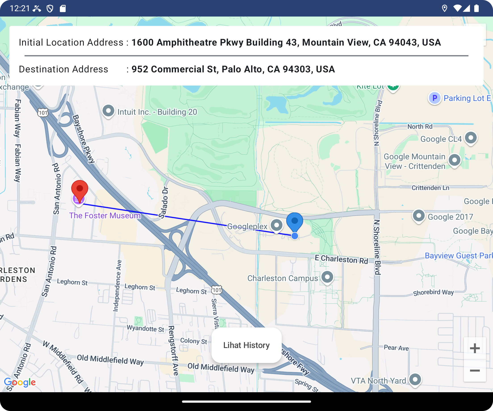
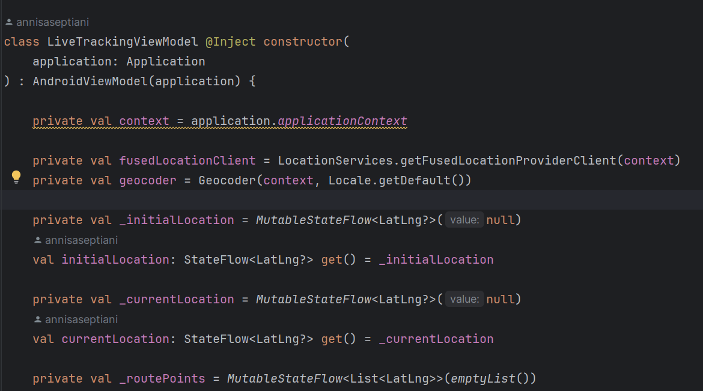
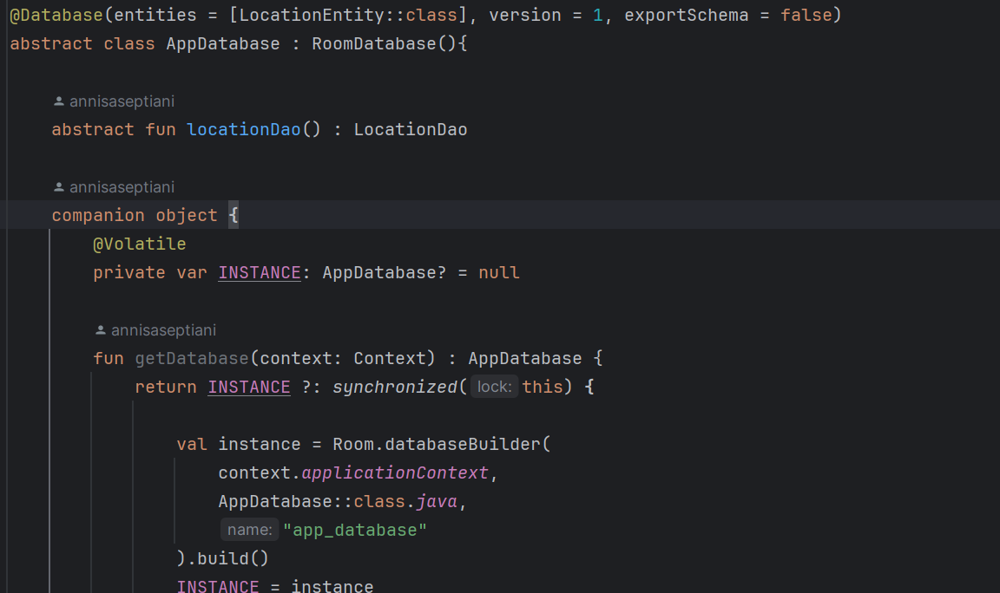
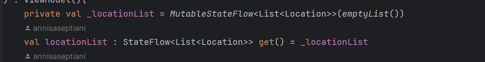
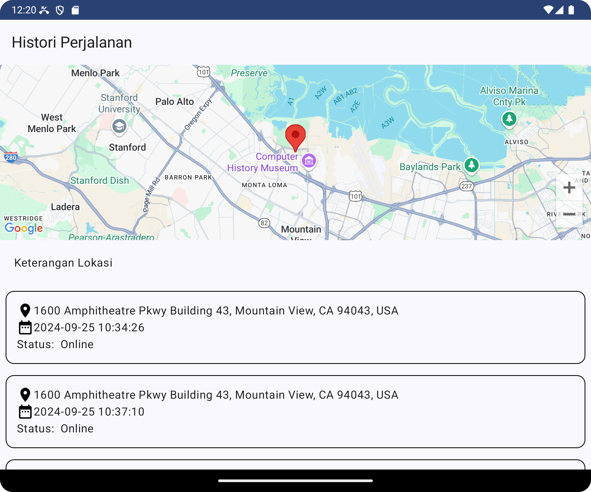
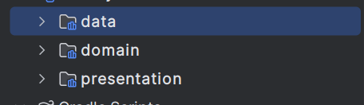
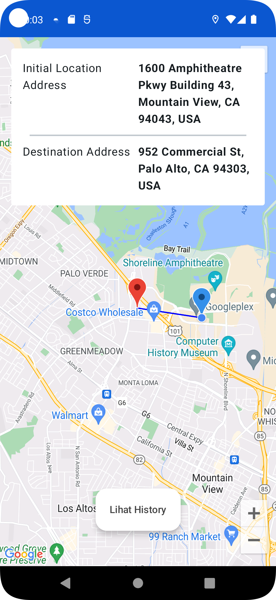
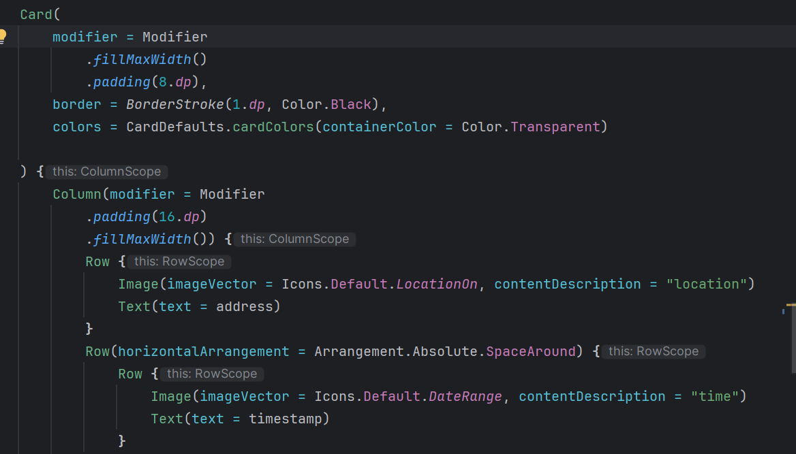
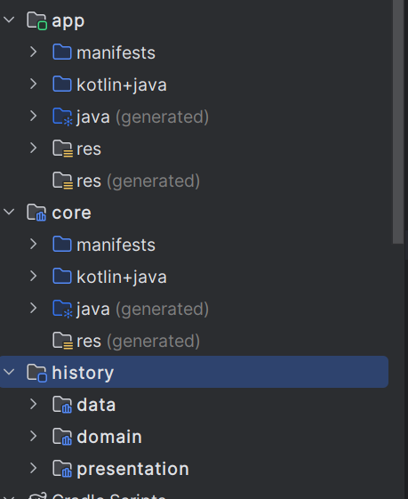

# Lagi Dimana

**Lagi Dimana** adalah aplikasi Android yang menampilkan lokasi terkini pengguna, serta menyimpan histori lokasi pengguna setiap 5 menit. Histori lokasi ini ditampilkan dalam bentuk daftar dan juga peta dengan titik pin point.

## Daftar Isi
- [Memulai](#memulai)
- [Prasyarat](#prasyarat)
- [Instalasi](#instalasi)
- [Menjalankan Aplikasi](#menjalankan-aplikasi)
- [Kriteria Wajib yang Tercover](#kriteria-wajib-yang-tercover)
- [Kriteria Tambahan](#kriteria-tambahan)
- [Dibangun Dengan](#dibangun-dengan)

## Memulai
Instruksi berikut akan memandu Anda dalam menyiapkan proyek ini di mesin lokal Anda untuk keperluan pengembangan dan pengujian.

## Prasyarat
Sebelum memulai, pastikan Anda telah memenuhi persyaratan berikut:
- Anda telah menginstal **Android Studio**.
- Anda memiliki **JDK** yang kompatibel (JDK 8 atau lebih tinggi).
- Anda telah menginstal **Git** di mesin lokal Anda. Anda bisa mengunduhnya [di sini](https://git-scm.com/).

## Instalasi
Ikuti langkah-langkah ini untuk menyiapkan proyek:

1. Clone repositori: Buka terminal dan jalankan perintah berikut:
    ```bash
    git clone https://github.com/annisaseptiani/LocationTrackerApp.git
    ```

2. Buka proyek di Android Studio:
   - Buka **Android Studio**. Klik **File -> Open**.
   - Arahkan ke direktori tempat Anda meng-clone repositori dan pilih folder tersebut. Klik **OK**.

3. Sinkronisasi proyek dengan file Gradle:
   - Setelah proyek terbuka, Android Studio akan meminta Anda untuk menyinkronkan proyek dengan file Gradle. Klik **Sync Now**.

4. Instal dependensi:
   - Pastikan semua dependensi yang diperlukan sudah terinstal. Android Studio biasanya akan mengurus ini selama proses sinkronisasi Gradle.

## Menjalankan Aplikasi
Setelah instalasi selesai, Anda bisa menjalankan aplikasi di emulator atau perangkat fisik melalui Android Studio.

1. Hubungkan perangkat atau jalankan emulator.
2. Klik tombol **Run** di Android Studio atau gunakan pintasan **Shift + F10**.

## Kriteria Wajib yang Tercover
Aplikasi **Lagi Dimana** memenuhi beberapa kriteria wajib berikut:

1. **Pengambilan dan penyimpanan lokasi**, lokasi disimpan menggunakan **Room** database untuk keperluan penyimpanan histori.
   

3. Menggunakan **Android Jetpack**, termasuk ViewModel, LiveData, dan Room untuk pengelolaan data dan UI.
   
   
   

4. **Menampilkan data histori** lokal dalam bentuk **list** dan **peta** dengan titik pin point untuk lokasi-lokasi yang sudah tersimpan.
   

5. **Pengambilan lokasi secara berkelanjutan** bahkan saat aplikasi berada dalam mode sleep, ditutup, atau saat perangkat offline.
   

6. Mengadopsi **arsitektur MVVM**, **Clean Architecture**, dan menjaga **clean code** untuk pemisahan tanggung jawab yang jelas antara data, domain, dan presentasi.
   
   

7. Menggunakan **Git** untuk versi kontrol dan kolaborasi kode.

## Kriteria Tambahan
Beberapa kriteria tambahan yang juga tercover dalam aplikasi ini:

1. Penanda **status koneksi** untuk menunjukkan apakah perangkat sedang online atau offline.
   

2. **Tampilan responsif** yang menyesuaikan dengan berbagai ukuran layar perangkat.
   
   

3. Menghapus komentar, indentasi yang rapi dan menghapus import yang tidak digunakan

4. Menggunakan **Jetpack Compose** untuk pengelolaan UI yang lebih modern dan deklaratif.
   

5. Aplikasi ini diimplementasikan dengan **multi module**, memisahkan berbagai fitur dan data untuk modularitas dan pengelolaan kode yang lebih baik.
   

## Dibangun Dengan
- **Android Studio** - IDE resmi untuk pengembangan Android.
- **Kotlin** - Bahasa pemrograman yang digunakan.
- **Gradle** - Sistem build otomatis untuk proyek Android.
- **Peta & Lokasi** - Fitur utama untuk menampilkan lokasi terkini dan histori.
- **Room Database** - Untuk penyimpanan data lokal.
- **Jetpack Compose** - Untuk pengelolaan UI.
- **Google Maps API** - Untuk menampilkan lokasi di maps
- **MVVM** - Sebagai arsitektur pattern
- **Multi-Module Architecture** - Untuk pemisahan fitur dan manajemen proyek yang lebih baik.
